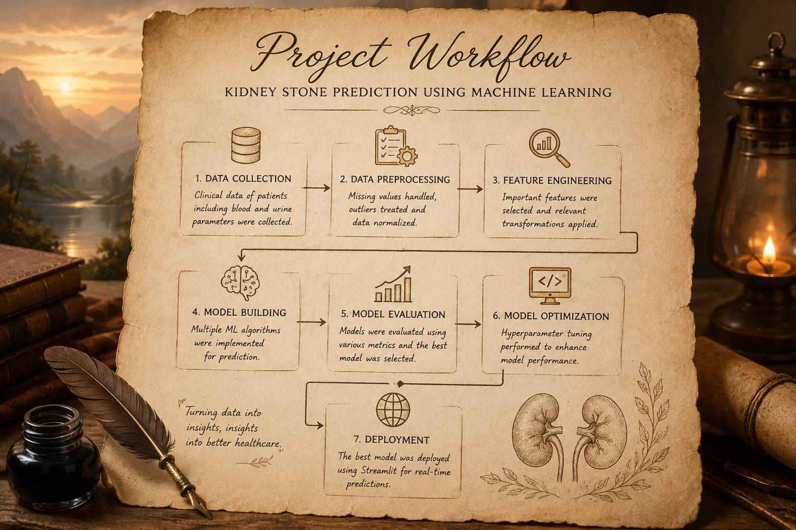
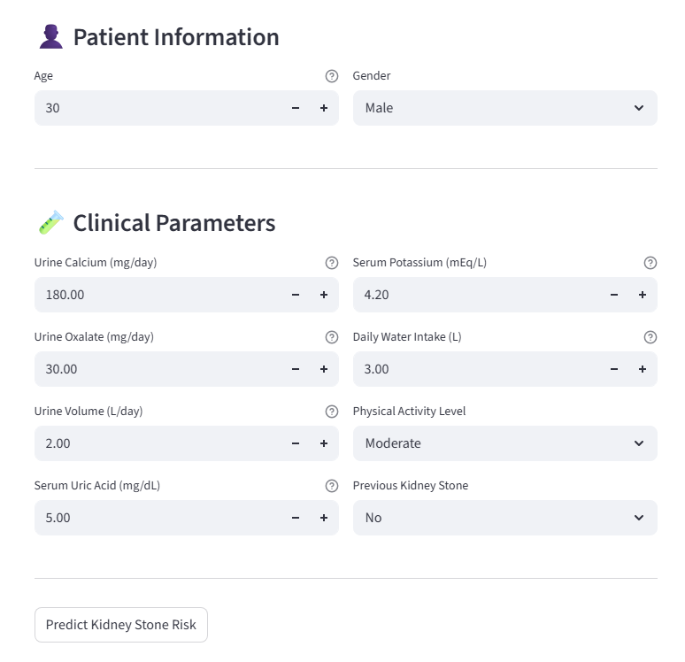
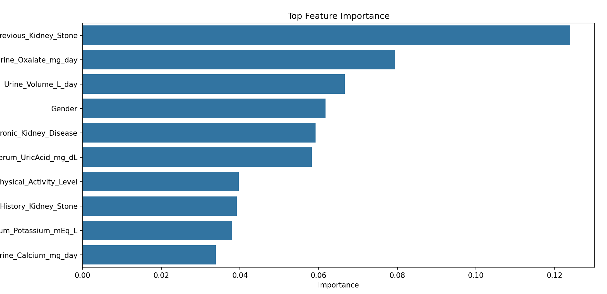
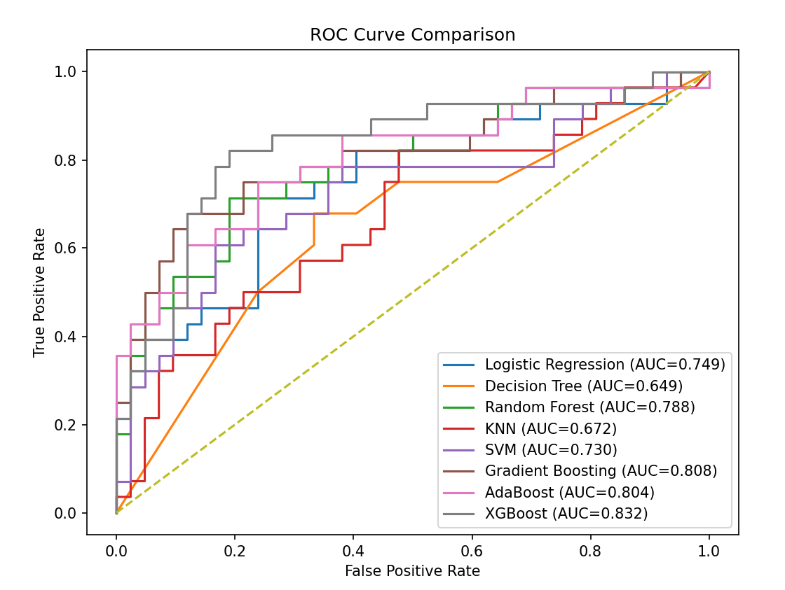
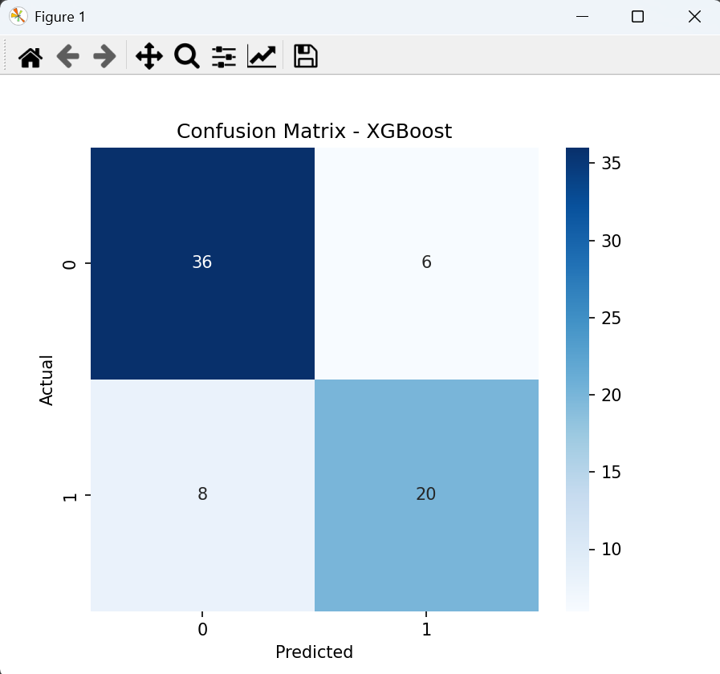

# 🩺 Predictive Modelling of Kidney Stones Using Clinical Urine and Blood Parameters

## 📌 Overview

This project presents a Machine Learning-based framework for early prediction of kidney stone disease using blood and urine clinical parameters.

The system compares multiple machine learning algorithms and deploys an interactive Streamlit application for real-time prediction.

---

## 🚀 Features

- Data preprocessing and cleaning
- Missing value handling
- Feature engineering
- Comparative ML analysis
- Hyperparameter optimization
- Real-time prediction using Streamlit

---

## 🤖 Machine Learning Models

- Logistic Regression
- Decision Tree
- Random Forest
- K-Nearest Neighbors (KNN)
- Support Vector Machine (SVM)
- AdaBoost
- Gradient Boosting
- XGBoost

---

## 📊 Evaluation Metrics

- Accuracy
- Precision
- Recall
- F1 Score
- Specificity
- ROC-AUC

---

## 🌐 Deployment

Interactive web application developed using **Streamlit**.

---

## 📚 Research Publication

**Title:**

*Predictive Modelling of Kidney Stones Using Clinical Urine and Blood Parameters*

Published in:

**International Journal of Intelligent Systems and Applications in Engineering (IJISAE)**

---

## 🛠️ Technologies Used

- Python
- Scikit-learn
- Pandas
- NumPy
- XGBoost
- Streamlit
- Matplotlib
- Seaborn
- Joblib

---

## 👨‍💻 Authors

- Priyamvad Ranjan
- Ritik Kumar
- Ronit Baweja

---

## 📷 Project Screenshots

## 🔄 Project Workflow

---

## 🌐 Streamlit Application

---

## 📊 Feature Importance

---

## 🏆 Model Performance Comparison

---

## 🔍 Confusion Matrix

---

## 📄 License

For educational and research purposes only.
